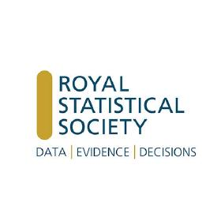

# Website of the R in HTA Hackathon
 __Belfast August 2024__

 

 

 
 

A 2 day event at Queen's University Belfast, Ireland for health economists, statisticians and R users

Welcome to the repository for the 2024 health economics in R hackathon.

* Please post ideas for projects, discussion topics, and sessions as [issues](https://github.com/n8thangreen/htahack2024/issues).

Event hashtag is `#htahack2024`

## Code of conduct

To ensure a safe, enjoyable, and friendly experience for everyone who participates, we have a [code of conduct](https://github.com/n8thangreen/htahack2024/blob/main/code-of-conduct.qmd). This applies to people attending in person or remotely, and for interacting over the [issues](https://github.com/n8thangreen/htahack2024/issues).

## Support

This meeting is made possible by generous support from the [International Centre for Mathematical Sciences (ICMS)](https://www.icms.org.uk/funding-opportunities/strategic-workshops).
